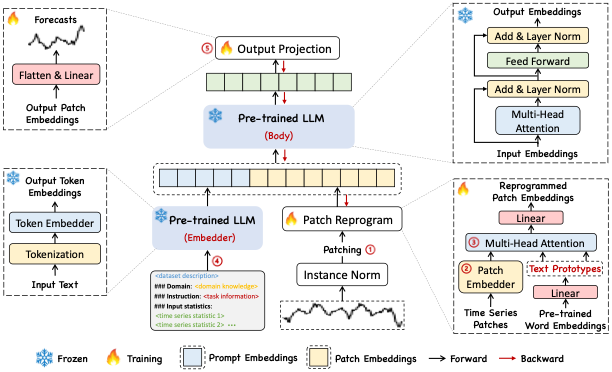
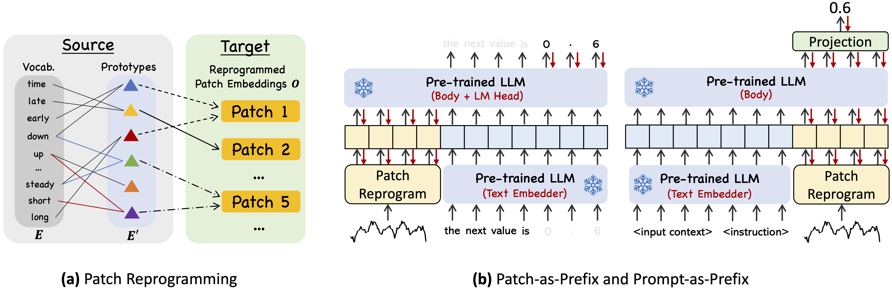

# Introduction

Time-LLM is a reprogramming framework to repurpose LLMs for general time series forecasting with the backbone language models kept intact.
Notably, we show that time series analysis (e.g., forecasting) can be cast as yet another "language task" that can be effectively tackled by an off-the-shelf LLM.

<p align="center">

</p>

- Time-LLM comprises two key components: (1) reprogramming the input time series into text prototype representations that are more natural for the LLM, and (2) augmenting the input context with declarative prompts (e.g., domain expert knowledge and task instructions) to guide LLM reasoning.

<p align="center">

</p>

# Requirements

Use python 3.11 from MiniConda

- torch==2.2.2
- accelerate==0.28.0
- einops==0.7.0
- matplotlib==3.7.0
- numpy==1.23.5
- pandas==1.5.3
- scikit_learn==1.2.2
- scipy==1.12.0
- tqdm==4.65.0
- peft==0.4.0
- transformers==4.31.0
- deepspeed==0.14.0
- sentencepiece==0.2.0

To install all dependencies:
```
pip install -r requirements.txt
```

### Note

Using `pip` to directly download `deepspeed==0.14.0` may encounter issues; it is recommended to use `pip install ./deepspeed-0.12.7+40342055-py3-none-any.whl` to download directly from the local source.

# Datasets

You can access the well pre-processed datasets from [[Google Drive]](https://drive.google.com/file/d/1NF7VEefXCmXuWNbnNe858WvQAkJ_7wuP/view?usp=sharing), then place the downloaded contents under `./dataset`

After downloading the dataset and storing it properly, the folder structure should look like this:
```
Time-LLM/
├── dataset/
│   ├── electricity/
│   ├── ETT-small/
│   ├── exchange_rate/
│   ├── illness/
│   ├── m4/
│   ├── PEMS/
│   ├── prompt_bank/
│   ├── solar/
│   ├── traffic/
│   ├── weather/
```

# Pre-trained model: GPT2

Please download the listed files from this [[link]](https://huggingface.co/openai-community/gpt2/tree/main) and then store them in the `./gpt2-pretrain` folder before the next step.
```
Time-LLM/
├── gpt2-pretrain/
│   ├── config.json
│   ├── generation_config.json
│   ├── merges.txt
│   ├── pytorch_model.bin
│   ├── tokenizer.json
│   ├── tokenizer_config.json
│   ├── vocab.json
```

# Experiments

## 1. Long-Term forecasting

You can directly start the experiment using `python run_main.py`.

Please make sure to check if the configuration file name on line `101` in `run_main.py` is `config_LONG-TERM_ETTh1_pred96.yaml`. If not, please change it to the correct configuration file name before running.

The corresponding experiment for this configuration file is: using `GPT2` as the backbone model, using the `ETT-h1` dataset, and conducting a long-term forecasting experiment with a sequence length of `96`. If you need to conduct long-term prediction experiments under other configurations, you can modify the corresponding parameters in the configuration file.

## 2. Short-Term forecasting

You can directly start the experiment using `python run_m4.py`.

Please make sure to check if the configuration file name on line `104` in `run_m4.py` is `config_SHORT-TERM_M4-Yearly_pred6.yaml`. If not, please change it to the correct configuration file name before running.

The corresponding experiment for this configuration file is: using `GPT2` as the backbone model, using the `M4-Yearly` dataset, and conducting a short-term forecasting experiment with a sequence length of `6`. If you need to conduct short-term prediction experiments under other configurations, you can modify the corresponding parameters in the configuration file.

## 3. Few-shot forecasting

You can directly start the experiment using `python run_main.py`.

Please make sure to check if the configuration file name on line `101` in `run_main.py` is `config_FEW-SHOT_ETTh1_pred96.yaml`. If not, please change it to the correct configuration file name before running.

The corresponding experiment for this configuration file is: using `GPT2` as the backbone model, using the `ETT-h1` dataset, and conducting a few-shot forecasting experiment with a sequence length of `96`. If you need to conduct few-shot prediction experiments under other configurations, you can modify the corresponding parameters in the configuration file.

## 4. Zero-shot forecasting

You can directly start the experiment using `python run_pretrain.py`.

Please make sure to check if the configuration file name on line `101` in `run_pretrain.py` is `config_ZERO-SHOT_ETTh1_ETTh2_pred96.yaml`. If not, please change it to the correct configuration file name before running.

The corresponding experiment for this configuration file is: using `GPT2` as the backbone model, using `ETT-h1` and `ETT-h2` as datasets, with a sequence length of `96`, conducting a zero-shot prediction experiment trained on `ETT-h1` and then transferred to `ETT-h2`. If you need to conduct zero-shot prediction experiments under other configurations, you can modify the corresponding parameters in the configuration file.

# Quick Demos

1. Download datasets and place them under `./dataset`
2. Tune the model. We provide five experiment scripts for demonstration purpose under the folder `./scripts`. For example, you can evaluate on ETT datasets by:

```bash
bash ./scripts/TimeLLM_ETTh1.sh 
```
```bash
bash ./scripts/TimeLLM_ETTh2.sh 
```
```bash
bash ./scripts/TimeLLM_ETTm1.sh 
```
```bash
bash ./scripts/TimeLLM_ETTm2.sh
```

# Detailed usage

Please refer to ```run_main.py```, ```run_m4.py``` and ```run_pretrain.py``` for the detailed description of each hyperparameter.